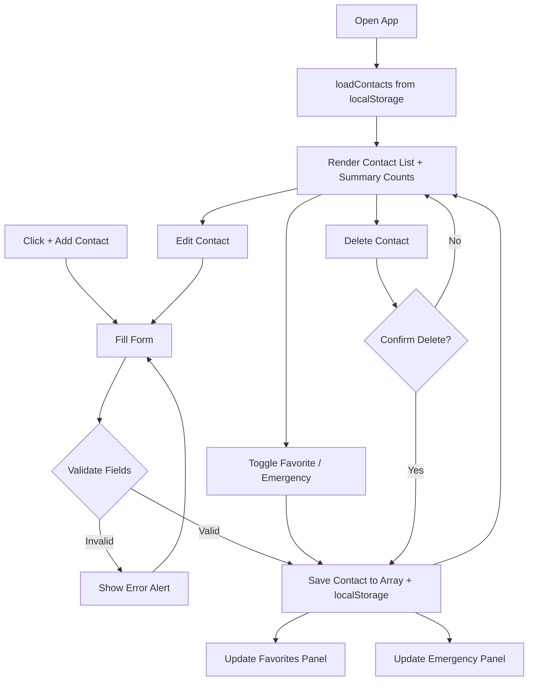
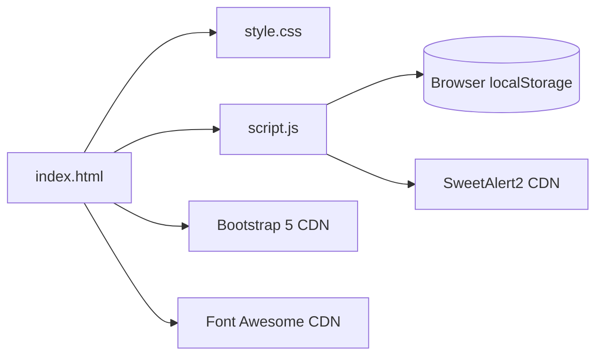

# ContactHub — Smart Contact Manager

A responsive contact management web app built with vanilla JavaScript, Bootstrap 5, and SweetAlert2. Add, edit, search, favorite, and flag contacts as emergency contacts — all stored locally in the browser.


---

## ✨ Features

- Add / edit / delete contacts with live field validation (name, Egyptian phone format, optional email)
- Mark contacts as **Favorite** ⭐ or **Emergency** 🩺 with quick-access side panels
- Live search by name or phone number
- Profile photo upload with instant preview
- Fully responsive layout (mobile, tablet, desktop)
- Data persisted in `localStorage` — no backend required


## 🧩 Tech Stack

| Layer          | Tools                              |
|----------------|-------------------------------------|
| Structure      | HTML5                               |
| Styling        | CSS3, Bootstrap 5, Font Awesome     |
| Logic          | Vanilla JavaScript (ES6)            |
| Alerts/Modals  | SweetAlert2                         |
| Storage        | Browser `localStorage`              |

## 📁 Project Structure

```
contacthub/
├── index.html
├── css/
│   └── style.css
├── js/
│   └── script.js
├── images/
│   └── (uploaded avatars & default assets)
└── README.md
```

## 🔄 App Flow



## 🏗️ File Relationships



## 🚀 Getting Started

No build step needed — it's a static site.

```bash
git clone https://github.com/<your-username>/<your-repo>.git
cd <your-repo>
```

Then just open `index.html` in your browser, or serve it locally:

```bash
# Option 1: VS Code Live Server extension
# Option 2: Python
python3 -m http.server 5500
```

## 📄 License

This project is licensed under the MIT License.
